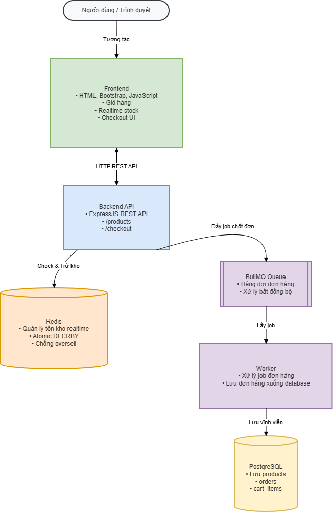
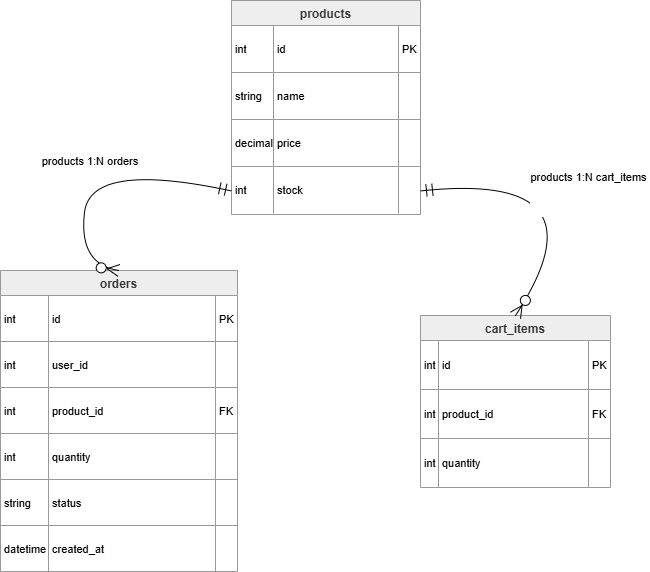

# Flash Sale E-commerce System

Hệ thống Flash Sale mô phỏng xử lý nhiều người dùng mua hàng đồng thời bằng Redis, BullMQ và PostgreSQL.

---

# Công nghệ sử dụng

- Frontend: HTML, Bootstrap, JavaScript
- Backend: Node.js, ExpressJS
- Database: PostgreSQL
- Cache / Realtime Stock: Redis
- Queue System: BullMQ
- Containerization: Docker

---

# Chức năng chính

- Hiển thị danh sách sản phẩm
- Giỏ hàng và checkout
- Realtime stock update
- Chống oversell bằng Redis Atomic Operation
- Xử lý bất đồng bộ bằng BullMQ Queue
- Load testing nhiều user đồng thời

---

# Kiến trúc hệ thống



---

# Database Schema / ERD



---

# API Documentation

Xem chi tiết tại:

```text
docs/api-documentation.md
```

---

# Cài đặt hệ thống

## 1. Clone project

```bash
git clone https://github.com/CanhLai/flash-sale-ecommerce-system.git
```

---

## 2. Chạy Docker

```bash
docker compose up
```

---

## 3. Chạy backend

```bash
cd backend
npm install
node index.js
```

---

## 4. Chạy frontend

Mở file frontend bằng Live Server hoặc trình duyệt.

---

# Load Testing

```bash
cd backend
node loadtest.js
```

Hệ thống hỗ trợ nhiều request đồng thời và ngăn oversell bằng Redis.

---

# Đặc điểm hệ thống

- Hỗ trợ xử lý nhiều request đồng thời
- Sử dụng Redis Atomic Operation để chống oversell
- Sử dụng BullMQ Queue để xử lý bất đồng bộ
- Hỗ trợ realtime stock update
- Hệ thống được triển khai bằng Docker

---

# Demo hệ thống

- Frontend Flash Sale
- Realtime stock update
- Queue xử lý đơn hàng
- Load testing nhiều user đồng thời

---

# Thành viên nhóm

- Thành viên A
- Thành viên B

---

# Môn học

Lập trình ứng dụng Web - UIT